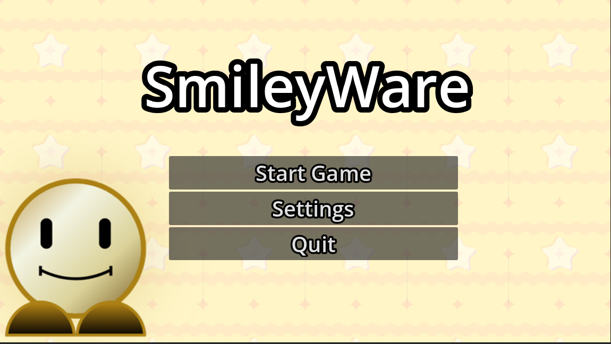
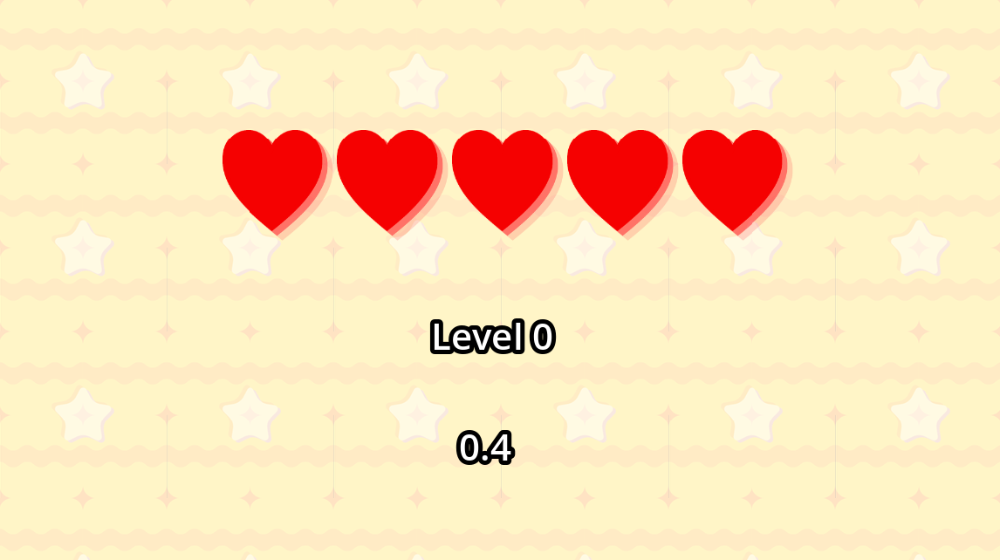
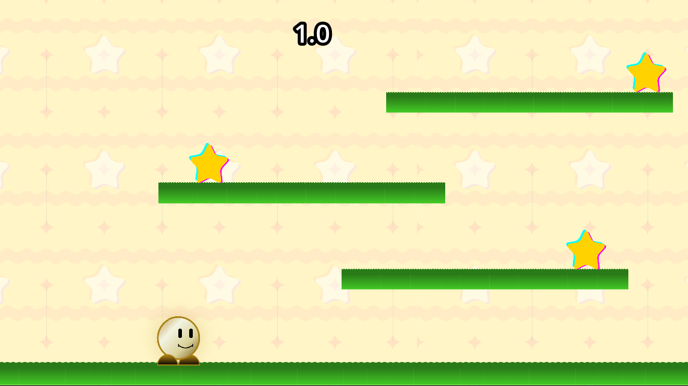
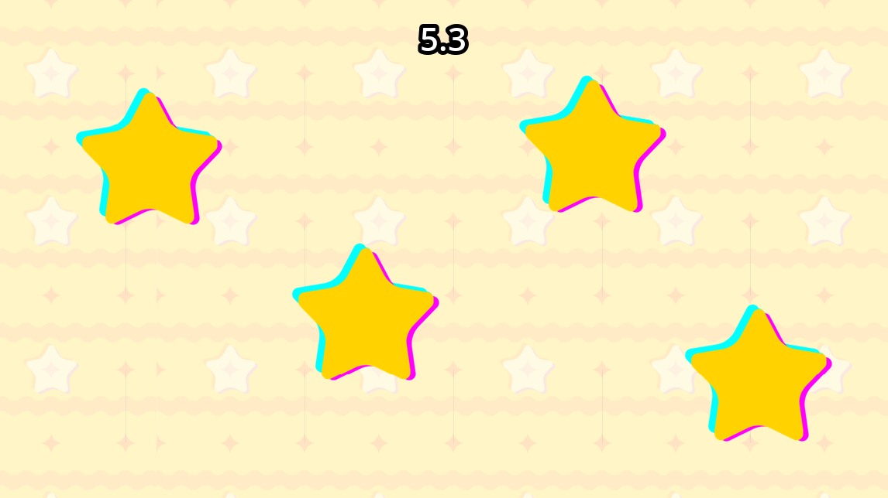
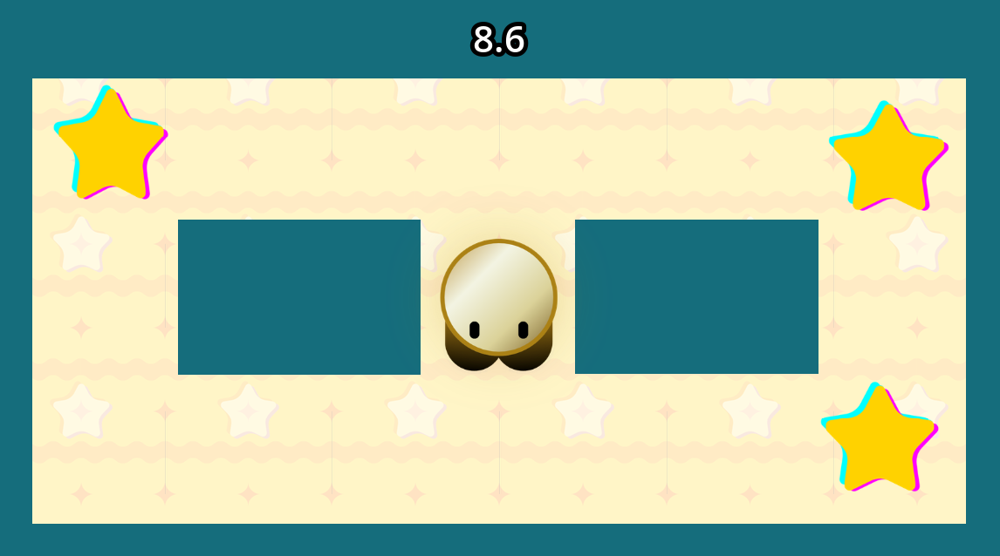
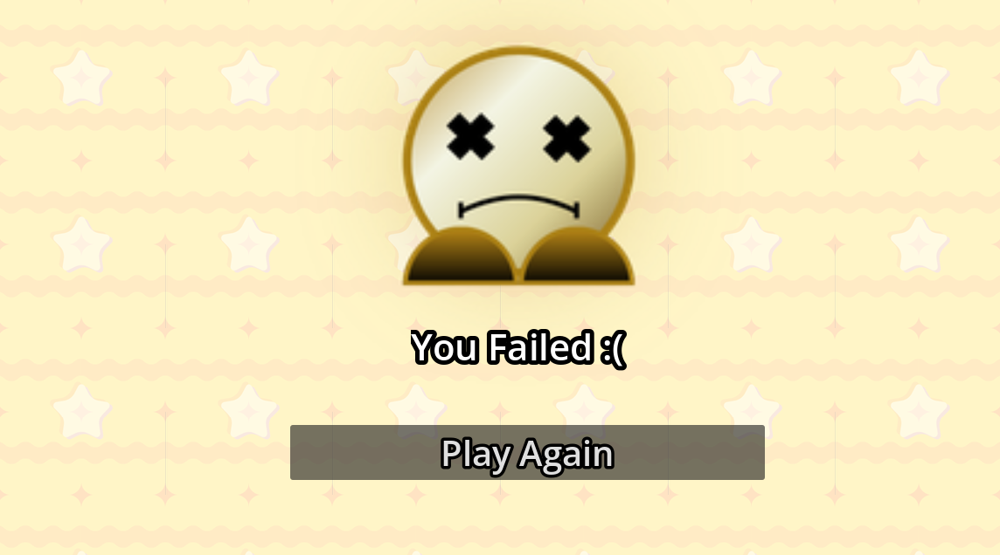
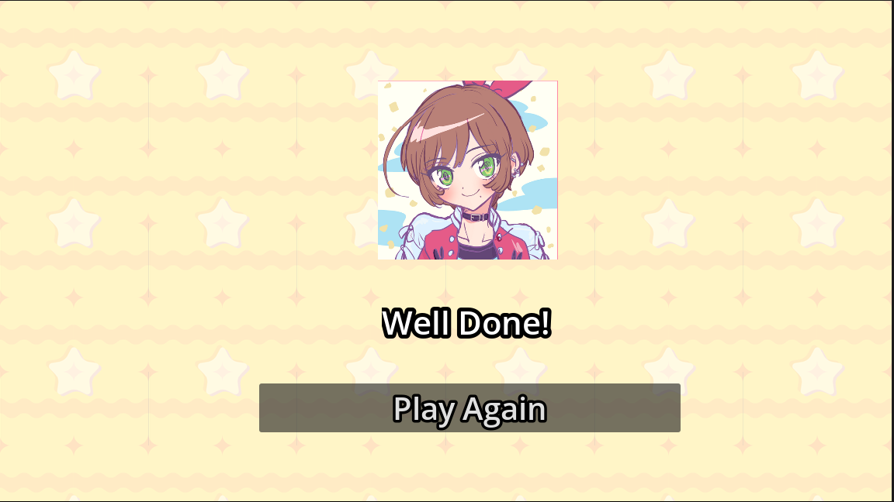

# SmileyWare

SmileyWare is a collection of fast-paced minigames inspired by the WarioWare style of gameplay. Each challenge is part of one connected game experience where players need to complete the minigames and keep progressing.

## Screenshots

### Title screen

### Level screen

### Minigame 1 (Platformer)

### Minigame 2 (Clicker)

### Minigame 3 (Maze)

### Death screen

### Winner screen

## Features
- Timed gameplay
- Lives and level progression
- Custom sprites and textures created in Canva
- Tree playful minigames
- Death and Winner screens

## Build with
- Godot
- GDScript
- Canva

## How to play

1. Download or clone this repository
2. Open the project folder in Godot
3. Run the project.
4. Play through the minigames and try to complete them all!

## Insipration
This project was created using a WarioWare-style game guide from Hack Club's Stardance program as a starting point. I followed the guide to learn how to build games in Godot, then added my own maze minigame, custom sprites, textures, and styling to make the project my own.

## Author

Made with ❤️ by [@kira-iovenko](https://github.com/kira-iovenko)

